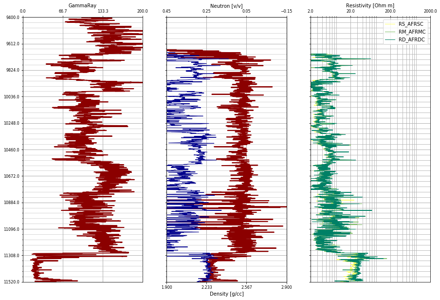
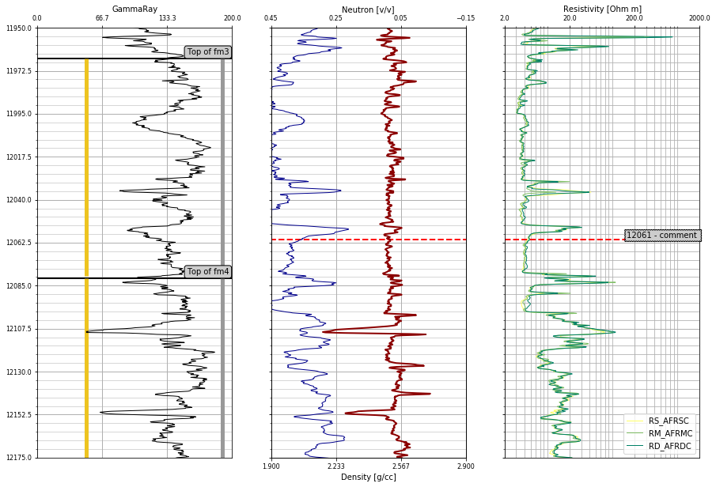
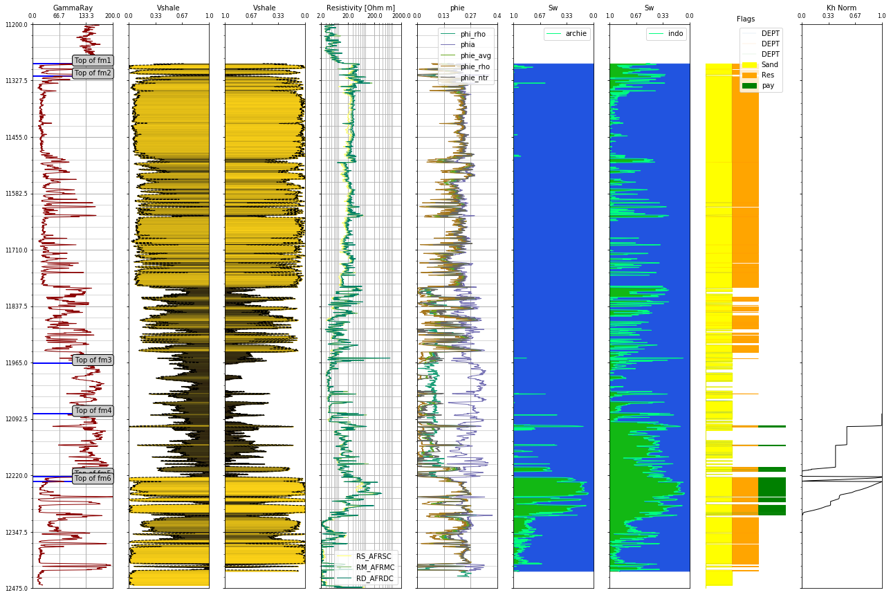

# Welllogspy - Module

Welllogspy is a module of Reservoirpy package to visualize Oil And Gas Well logs in order to make interpretetion and petrophysics analysis. 

It supports the reading and exporting `.las` files throughout the [Lasio package](https://github.com/kinverarity1/lasio) as well as the the visualization feature with the [Matplotlib package](https://matplotlib.org/). It is included basic equations for petrophysical calculation such as VShale, posority, Water saturation, permeability, flow capacity etc. 

## Getting Started

### Define Well attributes
The recomended workflow starts with defining the main attributes of a well throught the module [wellpy](https://scuervo91.github.io/reservoirpy/wellpy). This module contains a `class` named `reservoirpy.wellpy.path.wells` in which can be attached the basic attributes such as name, coordinates, elevation, formation tops and perforations. 

Let's define the first attributes of a well
```python
from shapely.geometry import Point

#Create the well object
name  = 'well-011'
rte   = 458.2 # Rotary table Elevation in ft
surf_coord = Point(872565.89,1055067.55) # Surface Coordinates defined as Point  
crs = 'EPSG:3117' # Coordinates reference System of the surface Coordinates
deviation = pd.read_csv('deviation.csv', header=[0])   #
print(deviation.head())

      md   inc    azi
0    0.0  0.00    0.0
1  193.0  0.06    0.0
2  375.0  0.12    0.0
3  559.0  0.33  347.6
4  651.0  0.36  340.5
```
Let's define some formations tops with the `class` `reservoirpy.wellpy.path.tops` which is a subclass of a `GeoDataFrame` to support spatial and geographic information. Hence it can be defined with the same sintaxis of `pandas.DataFrame` 

```python
from reservoirpy.wellpy import path as ph

#Tentative Formations Tops
tops = ph.tops([
            ['fm1',11289,11317,20,170,1.5],
            ['fm2',11318,11965,10,170,2],
            ['fm3',11966,12080,50,190,0.12],
            ['fm4',12081,12222,50,190,0.12],
            ['fm5',12223,12233,50,190,0.1],
            ['fm6',12234,12520,15,170,0.1]], 
            columns=['formation','md_top','md_bottom','gr_sand','gr_shale','rw'])
print(tops)

  formation  md_top  md_bottom  gr_sand  gr_shale    rw
0       fm1   11289      11317       20       170  1.50
1       fm2   11318      11965       10       170  2.00
2       fm3   11966      12080       50       190  0.12
3       fm4   12081      12222       50       190  0.12
4       fm5   12223      12233       50       190  0.10
5       fm6   12234      12520       15       170  0.10
```

Let's import some logs files in `.las` format with the class `reservoirpy.welllogspy.log.log` which is a subclass of `lasio.LASFile`. This package allows you to easily manipulate `.las` files. The full documentation of `lasio` can be checked [here](https://lasio.readthedocs.io/en/latest/). By adding the keyword arg `find_mnemonics=True` it search the mnemonics in the `.las` file in a mnemonics list with the purpose of classifing and modify its name by adding a prefix. 

```python
from reservoirpy.welllogspy.log import log 

#Upload logs
masterlog = log('master.las')
openlog = log('FE_BORAL-2_RES_GR_NUKES 27MAR2020_RC_MD.las', find_mnemonics=True)

Mnemonic:  ROPA  =>  ROP_ROPA
Mnemonic:  AFRMC  =>  RM_AFRMC
Mnemonic:  AFRSC  =>  RS_AFRSC
Mnemonic:  AFRDC  =>  RD_AFRDC
Mnemonic:  ALCDLC  =>  RHOB_ALCDLC
Mnemonic:  ALDCLC  =>  DCOR_ALDCLC
Mnemonic:  ALPELC  =>  PEF_ALPELC
Mnemonic:  TNPS  =>  NPHI_TNPS
```
Here `log` found some aliases and added a prefix for easily indentify the curves. For example it changed the name of `ALCDLC` to `RHOB_ALCDLC` 

If you have a list of mnemonics you could provide one.

```python
# list of mnemonics 
mn = pd.read_csv('mnemonics.csv')
openlog = log('FE_WELL-1_RES_GR_NUKES_RC_MD.las', find_mnemonics=True, mnemonics=mn)
```

### Create the well object

Now you can create the well object ```reservoirpy.wellpy.path.well```

```python
#Create the well
w1 = ph.well(name='well-1', 
             rte=rte, 
             surf_coord=surf_coord, 
             crs=crs, 
             survey=deviation, 
             tops=tops, 
             masterlog=masterlog, 
             openlog=openlog)
```
#### Survey
Just by adding a deviation in a `pandas.DataFrame` with the columns `md` `inc` `azi` it automatically estimates the whole trajectory and saves it as a `geopandas.GeoDataFrame`. 

```python
print(w1.survey.head())

        inc    azi         tvd       tvdss  northing_off  easting_off  \
md                                                                      
0.0    0.00    0.0    0.000000  458.200000      0.000000     0.000000   
193.0  0.06    0.0  192.999965  265.200035      0.101055     0.000000   
375.0  0.12    0.0  374.999732   83.200268      0.386939     0.000000   
559.0  0.33  347.6  558.998219 -100.798219      1.097142    -0.113784   
651.0  0.36  340.5  650.996554 -192.796554      1.628348    -0.267154   

           northing        easting      dleg  \
md                                             
0.0    1.055068e+06  872565.890000  0.000000   
193.0  1.055068e+06  872565.890000  0.031088   
375.0  1.055068e+06  872565.890000  0.032967   
559.0  1.055068e+06  872565.855319  0.116497   
651.0  1.055068e+06  872565.808571  0.056709   

                                          geometry  
md                                                  
0.0                   POINT (872565.89 1055067.55)  
193.0          POINT (872565.89 1055067.580801428)  
375.0          POINT (872565.89 1055067.667939113)  
559.0  POINT (872565.8553186734 1055067.884408979)  
651.0  POINT (872565.8085714115 1055068.046320477)  
```
##### Sample deviation and position

```python
#Sample Deviation
print(w1.sample_deviation(step=1200))
     new_md    new_inc     new_azi
0       0.0   0.000000    0.000000
1    1200.0   0.464889   77.208444
2    2400.0   1.202921  292.893146
3    3600.0   1.275730  111.190899
4    4800.0   0.357000  216.255333
5    6000.0   0.223418  298.941772
6    7200.0   4.083556  175.122667
7    8400.0  18.795169  181.792697
8    9600.0  19.869667  184.567667
9   10800.0  19.243333  180.520222
10  12000.0  19.098090  182.625056
11  12520.0  19.000000  182.500000
```

```python
#Sample position
w1.sample_position(step=1000)
	new_tvd	      new_easting	      new_northing	geometry
0	0.000000	      872565.890000	1.055068e+06	POINT (872565.89 1055067.55)
1	1000.000000	      872566.052011	1.055068e+06	POINT (872566.0520107029 1055068.407413885)
2	2000.000000	      872567.896003	1.055069e+06	POINT (872567.896002662 1055068.689646338)
3	3000.000000	      872564.081982	1.055071e+06	POINT (872564.0819821098 1055071.23953189)
4	4000.000000	      872567.685563	1.055070e+06	POINT (872567.6855628713 1055069.716064421)
5	5000.000000	      872565.648551	1.055068e+06	POINT (872565.6485511566 1055068.094850884)
6	6000.000000	      872565.444154	1.055067e+06	POINT (872565.4441539444 1055067.155175879)
7	7000.000000	      872563.041084	1.055064e+06	POINT (872563.0410836361 1055064.203559785)
8	8000.000000	      872559.885232	1.055025e+06	POINT (872559.8852320506 1055024.739904086)
9	9000.000000	      872554.719046	1.054924e+06	POINT (872554.7190457062 1054924.489190781)
10	10000.000000	872547.778810	1.054815e+06	POINT (872547.7788097903 1054814.923485559)
11	11000.000000	872544.571999	1.054709e+06	POINT (872544.5719993383 1054709.296589075)
12	12000.000000	872539.030480	1.054604e+06	POINT (872539.0304796824 1054604.29235992)
13	12261.793994	872537.466172	1.054577e+06	POINT (872537.466172102 1054577.338434098)
```
##### Interpolate tvd, tvdss, coordinate
```python
depth = 10525

d_tvd, = w1.to_tvd(md=depth)
d_tvdss, = w1.to_tvd(md=depth,ss=True)
d_coord, = w1.to_coord(md=depth)

print(f"From {depth} md to: \n  {d_tvd} tvd \n  {d_tvdss} tvdss \n  {d_coord.wkt}")

From 10525 md to: 
  10375.274675782086 tvd 
  -9917.074675782085 tvdss 
  POINT (872546.0670174527 1054774.841069868)
```
##### Get the tvd tvdss and coord of formation well tops
In the same way, by having the tops depths in md, you can estimate the tvd, tvdss and coordinate of each top

```python
w1.to_tvd(which=['tops'])
b2.to_tvd(which=['tops'], ss=True)
b2.to_coord(which=['tops'])

print(w1.tops.head())
  formation  md_top  md_bottom  gr_sand  gr_shale    rw       tvd_top  \
0       fm1   11289      11317       20       170  1.50  11097.725298   
1       fm2   11318      11965       10       170  2.00  11125.126179   
2       fm3   11966      12080       50       190  0.12  11736.912223   
3       fm4   12081      12222       50       190  0.12  11845.698653   
4       fm5   12223      12233       50       190  0.10  11980.432761   

     tvd_bottom    tvd_tick  
0  11124.181321   26.456023  
1  11735.967303  610.841124  
2  11844.750557  107.838335  
3  11979.483886  133.785232  
4  11989.921518    9.488757 
```

##### Assign to each depth of the logs a Formation according to tops

You can assing each step of the well log to a formation top. It adds a column to the `log` class with the name of the formation. 
```python
w1.tops_to_logs(which=['masterlog','openlog'])
```
As `log` is a subclass of `lasio.LASFile`, you can easily tranform the data to a `pandas.DataFrame` by calling `.df()` method.

```python
print(w1.openlog.df()[['ROP_ROPA','formation']].tail())

          ROP_ROPA formation
DEPT                        
12519.25   24.8921       fm6
12519.50   24.8910       fm6
12519.75   24.8984       fm6
12520.00   23.9366       fm6
12520.25   23.3663       NaN
```

## Logs Visualization 

To visualize the well logs it is recommended having the data in a `pd.DataFrame` format. To do that, either you are using `lasio.LASFile` or `reservoirpy.welllogspy.log.log`, by calling the method `.df()` it converts all data of the las object to DataFrame (as shown above). 

The visualization of logs is based on Tracks functions. Each log track is implemented through a single function that plot the desired data. For example, the `grtrack` is composed generally by GammaRay and Sp logs, so this function can plot the GammaRay and SP logs with optional features like add Well tops (Formations or Units), Gr clean and Gr shale to Vshale estimations, etc...

Next are the list of tracks available so far:

* grtrack -> Gamma Ray and Sp track. 
* dntrack -> Neutron Density track
* restrack -> Resistivity track
* vshtrack -> Vshale track
* phietrack -> porosity track
* gastrack -> Gas chromatograpy track
* swtrack -> Water saturation Track
* caltrack -> calliper track
* cbltrack -> cbltrack
* flagtrack -> Sand, Reservoir and Pay track
* khtrack -> Normalized Flow capacity Track
* oilshowtrack -> Oil show Track
* track -> template track for any kind of curve

### Usage

Having the data in a  `pd.DataFrame` (indexed with the depth) just call the tracks you want to plot, define the column name and the axes, like in `matplotlib`. 

```python
from reservoirpy.welllogs import tracks as tk
logs = w1.openlog.df()

From = 9400
To = 11520

fig, ax = plt.subplots(1,3, figsize=(15,10))

tk.grtrack(logs,gr='DGRCC', gr_max=200, ax=ax[0],lims=[From,To])
tk.dntrack(logs,rho='RHOB_ALCDLC',ntr='NPHI_TNPS', ax=ax[1],lims=[From,To])
tk.restrack(logs, res=['RS_AFRSC', 'RM_AFRMC', 'RD_AFRDC'], ax=ax[2], res_range=[2,2000],lims=[From,To])
```


#### Customization 

On each track function can be set a series of parameters to change the color, width, style, etc... of the curves to plot. The options are those allowed by `matplotlib`. Just by adding a dictionary with the parameters like:

```python
tk.grtrack(logs,gr='DGRCC', ax=ax[0], gr_kw={'linewidth':1, 'color':'black'})
```
This can be set on any curve `sp_kw`, `rho_kw`, `ntr_kw`, `vsh_kw`. For track like `restrack`, `gastrack` which can receive multiple curves at once through a list of names, teh desired parameters can be passed as a list of dictionaries

```python
tk.restrack(logs, res=['RS_AFRSC', 'RM_AFRMC', 'RD_AFRDC'], ax=ax[3], res_range=[2,2000],
            res_kw=[
              {'linewidth':3, 'color':'darkgreen'},
              {'linestyle':'--', 'color':'green'},
              {'linestyle':'-.', 'color':'lightgreen','linewidth':3 }
            ])
```
Other keywords like `step` and `grid_number` control the plot gridding behavior.

* `step=[10,2]` Make the mayor grids each 10 ft and minor grid each 2 ft
* `grid_number=[51,11]` Make 50 bins for minor grid and 10 bins for mayor grid within the interval of depth. If neither is set the default behavior is `grid_number=[51,11]`
* `lims=[11000,12000]` Control the interval depth to plot the logs. If not defined the lims are the maximun and minimum depth in the `DataFrame`

On the grtrack can be included besides `gr` and `sp` curves, lines like Sand-GR, Shale-GR, Formation tops, Perforations, and Correlation lines (Correlation can be set in all Tracks) which as the other curves a keyword dictionaru can be passed to manipulate their behavior. The list of curves are the next:

* Gr Sand -> Columns: 'md_top', 'md_bottom', 'gr_sand' 
* Gr Shale -> Columns: 'md_top', 'md_bottom', 'gr_shale' 
* Perforation -> Columns: 'md_top', 'md_bottom', 'comment'
* Tops -> Columns: 'md_top', 'md_bottom', 'formation'
* Correlaton -> Columns: 'depth', 'comment'

These properties are `pd.DataFrame` objects with specific column name to be interpreted by the function

Example:
```python
#Correlation
anot = pd.DataFrame({'depth':[12061],'comment':["comment"]})

#Tops
tops = w1.tops
topf = tops[tops['formation'].isin(['fm3','fm4'])]

#Lims
From = 11950
To = 12175
fig, ax = plt.subplots(1,3, figsize=(15,10))

tk.grtrack(logs, gr='DGRCC', lims=[From,To],
           gr_max=200, ax=ax[0], 
           gr_sand_shale = topf, 
           fm = topf, lims=[From,To],
           fm_kw={'ann':True,'color':'black', 'linewidth':2}, 
           gr_kw={'linewidth':1, 'color':'black'}, 
           gr_sand_kw={'linewidth':5, 'color':(237/255,196/255,33/255)},
           gr_shale_kw={'linewidth':5, 'color':(0.6,0.6,0.6)})


tk.dntrack(logs,rho='RHOB_ALCDLC',ntr='NPHI_TNPS', 
           ax=ax[1],correlation=anot,lims=[From,To])
tk.restrack(logs, res=['RS_AFRSC', 'RM_AFRMC', 'RD_AFRDC'], 
            ax=ax[2], res_range=[2,2000],
            correlation=anot,
            corr_kw={'ann':True},
            lims=[From,To])
```



### Petrophysical Calculation

Petrophyscial properties can be calculated by calling the function  `petrophysics` which wrapps the main equations.

By passing dictionaries to the arguments specifying methods, input curves names, output curves names.

The next example estimate the petrophysics properties for each of the tops by iterating over the rows of the `tops` table of the `well` object where the petrophysical parameters are specified.
```python
#Specify parameters to estimate petrophysics
from reservoirpy.welllogs import petrophysics as pt

logpt = pd.DataFrame()
for i in w1.tops.iterrows():

    logv = pt.petrophysics(logs,i[1]['md_top'],i[1]['md_bottom'],
          #Vshale by GammaRay
          vshale_gr_kw=dict(vsh_col_name='vsh_gr', gr_name='DGRCC', 
                        gr_sand=i[1]['gr_sand'], gr_shale = i[1]['gr_shale']),

          #Vshale with Neutron Density
          vshale_dn_kw=dict(vsh_col_name='vsh_dn', rho_name='RHOB_ALCDLC',
                        ntr_name='NPHI_TNPS'),

          #Porosity by Density    
          phi_rho_kw=dict(phi_rho_name='phi_rho', rho_name='RHOB_ALCDLC'),

          #Effective Porosity
          phie_kw=dict(phi_rho_name='phi_rho',ntr_name='NPHI_TNPS', 
                  vsh_name='vsh_dn'),

          #Water Saturation
          sw_kw=dict(rt_name='RD_AFRDC',phi_name='phie_avg',vsh_name='vsh_dn', 
                rw=i[1]['rw'],methods=['archie','indo'],a=1,m=2,n=2),

          #Flags
          flag_kw=dict(vsh_name='vsh_gr',phi_name='phie_avg',sw_name='archie',vsh_cutoff=0.7,
                  phi_cutoff=0.1,sw_cutoff=0.60,which='pay'),

          #Permeability
          perm_kw = dict(phi_name='phie_avg',swir=0.1,authors=['timur','morris','coates']),

          #Norm Flow Capacity
          kh_kw = dict(perm_name='timur', pay_name='pay_flag'), 
          
          # True only return the dataframe with the depth interval selected to estimate petrophysics
          # False to return the entire dataframe given with only the interval calculated. 
          return_partial=True)
    
    logpt = logpt.append(logv)
logpt.columns
```

```python
From = 11200
To = 12475

fig, ax = plt.subplots(1,9, figsize=(22,15))
tk.grtrack(logs,gr='DGRCC', gr_max=200, ax=ax[0], fm=tops, 
           fm_kw={'ann':True,'color':'blue', 'linewidth':2}, 
           gr_kw={'linewidth':1}, lims=[From,To])

tk.vshtrack(logpt,vsh='vsh_gr',ax=ax[1],fill=True, inverse=False,lims=[From,To])
tk.vshtrack(logpt,vsh='vsh_dn',ax=ax[2],fill=True, inverse=True,lims=[From,To])
tk.restrack(logs, res=['RS_AFRSC', 'RM_AFRMC', 'RD_AFRDC'], ax=ax[3], res_range=[2,2000],lims=[From,To])
tk.swtrack(logpt, sw=['archie'],ax=ax[5], fill=True,lims=[From,To])
tk.swtrack(logpt, sw=['indo'],ax=ax[6], fill=True,lims=[From,To])
tk.phietrack(logpt,phi=['phi_rho', 'phia', 'phie_avg','phie_rho', 'phie_ntr'], ax=ax[4],lims=[From,To])
tk.flagtrack(logpt, sand='sand_flag',res='reservoir_flag',pay='pay_flag', ax=ax[7], legend=True,lims=[From,To])
tk.khtrack(logpt, kh='kh_norm', ax=ax[8], fill=False,lims=[From,To])
```



### Add the petrophysics logs to the `well` Object

After the logs analyzed the results can be added to the logs stored on the `well` object

```python
w1.add_to_logs(logpt)
```

### Analyze intervals

You can create the object `reservoirpy.wellpy.path.perforations` like `tops` class to add perfoations interval to the `well` object.

```python
#Create two Perforations interval
p_tentative= ph.perforations({'md_top':[12224,12234],'md_bottom':[12232,12242]})

#Add to the well object
w1.perforations = p_tentative 

#Estimate tvd and tvdss
w1.to_tvd(which=['perforations'])
w1.to_tvd(which=['perforations'],ss=True)

#Estimate interval tick and midpoint
w1.perforations.get_tick()
w1.perforations.get_mid_point()

print(w1.perforations)

   md_top  md_bottom       tvd_top    tvd_bottom  tvd_tick     tvdss_top  \
0   12224      12232  11981.381637  11988.972643  7.591006 -11523.181637   
1   12234      12242  11990.870394  11998.461400  7.591006 -11532.670394   

   tvdss_bottom  md_tick  md_mid_point  tvd_mid_point  tvdss_mid_point  
0 -11530.772643        8       12228.0   11985.177140    -11526.977140  
1 -11540.261400        8       12238.0   11994.665897    -11536.465897  
```

#### Get Intervals attributes

```python
perf_atr = w1.interval_attributes(
    perforations=True,
    curves=['vsh_dn','phie_avg','archie','timur','coates','kh'],
    aggfunc={
        'vsh_dn':'mean',
        'phie_avg':['min','max','mean'],
        'archie':['min','max','mean'],
        'coates':['min','max','mean'],
        'kh':'sum'
    })
print(perf_atr)


   md_top  md_bottom       tvd_top    tvd_bottom  tvd_tick     tvdss_top  \
0   12224      12232  11981.381637  11988.972643  7.591006 -11523.181637   
1   12234      12242  11990.870394  11998.461400  7.591006 -11532.670394   

   tvdss_bottom  md_tick  md_mid_point  tvd_mid_point     ...       \
0 -11530.772643        8       12228.0   11985.177140     ...        
1 -11540.261400        8       12238.0   11994.665897     ...        

   (phie_avg, min)  (phie_avg, max)  (phie_avg, mean)  (archie, min)  \
0         0.089359         0.174152          0.150632       0.222784   
1         0.169648         0.236727          0.218984       0.083474   

   (archie, max)  (archie, mean)  (coates, min)  (coates, max)  \
0       1.000000        0.321323       5.738459      82.785534   
1       0.456206        0.160189      74.547543     282.637857   

   (coates, mean)    (kh, sum)  
0       49.892554   732.054260  
1      212.089875  3620.486361
```